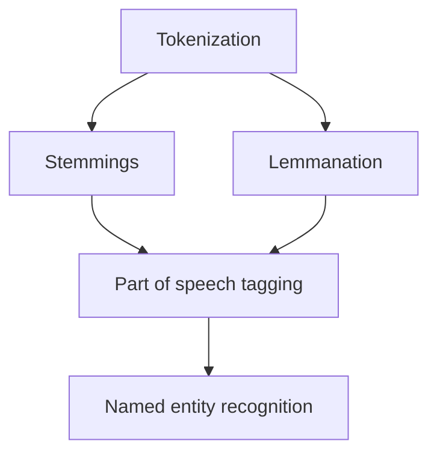

## About

- NLP is used to translate unstructured data (such as natural language) into structured data and the other way around
- NLU: natural language understanding: unstructured to structured
- NLG: natural language generation: structured to unstructured

## Unstructured Data

> "Add eggs and milk to my shopping list"

## Structured Data

``` html
<SHOPPING LIST>
    <ITEM> Eggs </>
    <ITEM> Milk </>
</>
```

## Usecases NLP

- Named-Entity-Recognition (NER)
- Part-of-Speech Tagging (POS)
- Syntactic parsing
- Text categorization
- Coreference Resolution
- Machine Translation

## Usecases NLU

- Relation Extraction
- Semantic Parsing
- Question and Answering
- Paraphrasing
- Sentiment Analysis
- Summarization

## Usecases NLG

- TODO

## Usecase Examples

1. Machine translation
2. Virtual assistant / chatbot
3. Sentiment analysis
4. Spam detection
5. Information extraction

## General approach



### Tokenization

- taking a string and breaking it down into chunks
- e.g. 8 words $\rightarrow$ 8 tokens
- now can work on one token at a time

### Stemming

- deriving the word stem for a given token
- e.g. "running", "runs", "ran" $\rightarrow$ "run"
- ! stemming does not work well for every token:
  - e.g. "universal", "university" $\neq$ "universe"
  - for that use [[Lemmatization|cs.ai.nlp#lemmatization]]

### Lemmatization

- takes a token and learns its meaning through a dictionary definition
- derives root (lem)
- e.g. "better" $\rightarrow$ "good"

### Part of speech tagging

- look where a given token is used in the context of a sentence
- e.g. "make":
  - "I am going to **make** dinner." $\rightarrow$ "make is verb"
  - "What make is your laptop?" $\rightarrow$ "make is noun"

### Named entity recognition

- for a given token, is there an entity associated with it?
- e.g. "Arizona" is entity of "state in the US"
- e.g. "Ralph" is entity of "a persons name"